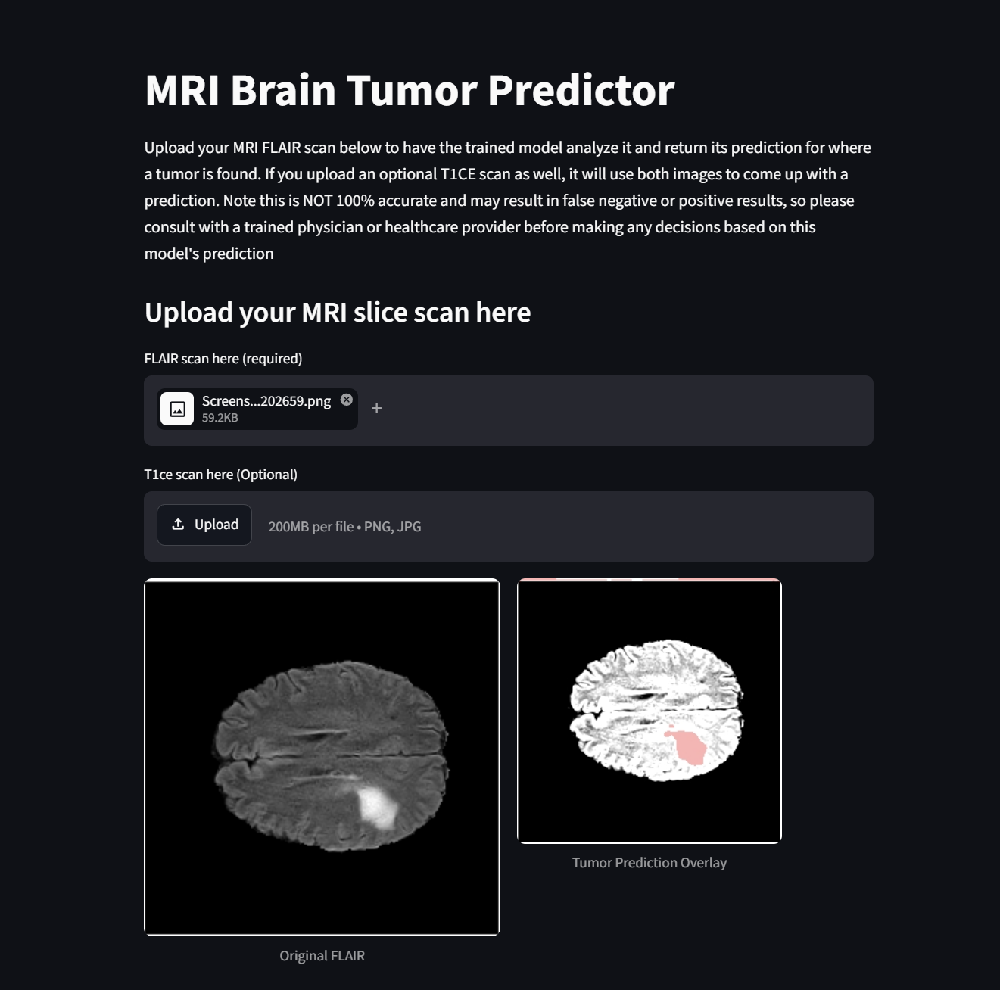
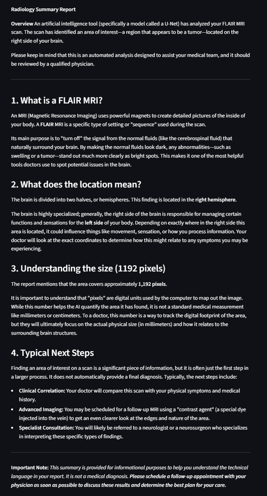

# Brain Tumor MRI Segmentation

A deep learning web application that segments brain tumors from MRI scans and generates plain-English radiology summaries using a large language model.

**[Live Demo](https://brain-tumor-segmentation-mri.streamlit.app/)** | **[Training Notebook](https://www.kaggle.com/code/mehananagarur/neuro-cs-project)**

---

## Demo




---

## How It Works

1. Upload a FLAIR MRI slice (T1ce is optional but will improve accuracy)
2. A trained U-Net model segments the tumor region in real time
3. The predicted tumor boundary is overlaid in red on the original scan
4. An AI-generated radiology summary is produced using the Gemini API. This is in plain English and should be understood by the average person.

---

## Model Architecture

- **Architecture:** U-Net with ResNet34 encoder and scSE attention decoder
- **Library:** segmentation-models-pytorch
- **Input:** 2-channel (FLAIR + T1ce), 256×256 axial MRI slices
- **Loss:** Combined Dice + Binary Cross Entropy
- **Dataset:** BraTS 2020 (369 patients, ~50,000 valid slices)
- **Augmentation:** Albumentations pipeline (HorizontalFlip, RandomRotate90, ElasticTransform, RandomBrightnessContrast)

---

## Results

Model : Dice Score

Baseline U-Net (FLAIR only) = 0.4219
U-Net + T1ce modality = 0.4283
Attention U-Net (scSE) = 0.4204
Augmented model (in progress) = 0.3747*

*Augmented model is still training and the lower score reflects insufficient epochs, not augmentation failure

---

## Tech Stack

- **Model:** PyTorch, segmentation-models-pytorch, Albumentations
- **Data:** BraTS 2020, nibabel, numpy
- **App:** Streamlit
- **LLM:** Google Gemini API
- **Model Hosting:** Hugging Face Hub
- **Training:** Kaggle T4 GPU

---

## Run Locally

```bash
git clone https://github.com/mehanana/brain-tumor-segmentation.git
cd brain-tumor-segmentation
pip install -r requirements.txt
```

Create a `.env` file:
GEMINI_API_KEY=your_key_here


Run the app:
```bash
streamlit run app.py
```

---

## Disclaimer

This tool is for educational and portfolio purposes only. It is not a medical device and should not be used for clinical diagnosis. Always consult a qualified physician for medical decisions.